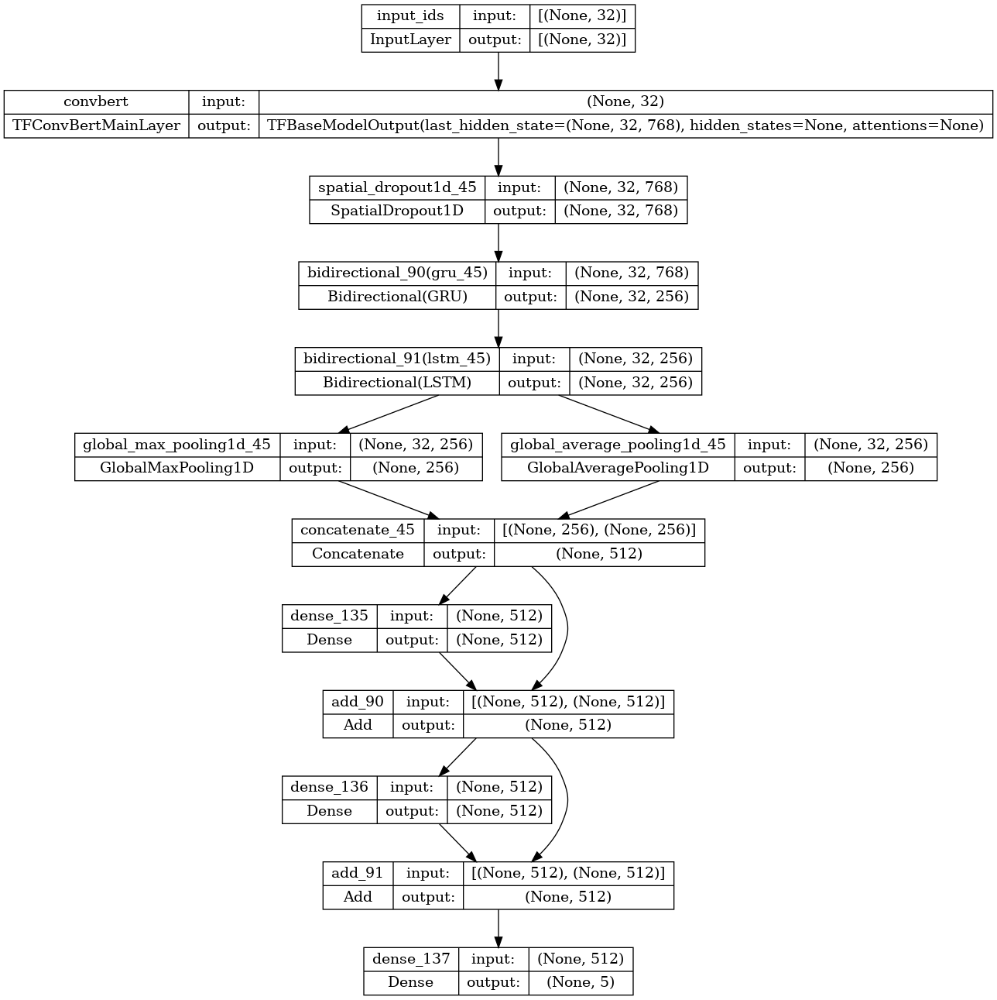
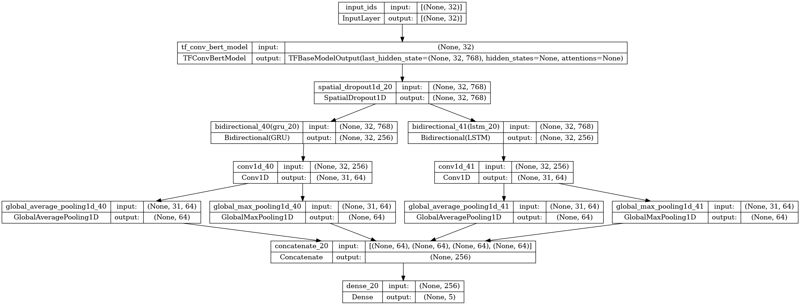

# Aşağılayıcı Söylemlerin Doğal Dil İşleme İle Tespiti
# TRT DATA WARRIORS TEAM
## <b>HIZLI BAŞLANGIÇ</b>

<b>NOTE: Modellere erişmek için <a href='https://huggingface.co/emirkocak/TRT_Data_Warriors_tackling_hate_speech'>HuggingFace</a> sayfasını ziyaret edebilirsiniz.</b>


### <b>Gereksinimler</b>
Conda paket yöneticisi en son sürümde olmalıdır.

Herhangi bir CUDA/GPU sorunuyla karşılaşmamak için doğru bir biçimde conda ortamları kurulmalı ve requirements.txt içindeki paket versiyonlarına dikkat edilmelidir. Tensorflow GPU için komutlar aşağıdaki gibi uygulanabilir. Tüm kurulum adımları environment.yml içinde verilmiştir. 

```shell
conda create --name=tf_gpu python=3.9
conda activate tf_gpu
conda install -c conda-forge cudatoolkit=11.2.2 cudnn=8.1.0
mkdir -p $CONDA_PREFIX/etc/conda/activate.d
echo 'export LD_LIBRARY_PATH=$LD_LIBRARY_PATH:$CONDA_PREFIX/lib/' > $CONDA_PREFIX/etc/conda/activate.d/env_vars.sh

# restart program/server
conda activate tf_gpu
python3 -m pip install tensorflow==2.10
```

### <b>Ortam Kurulumu</b>
Projeyi sorunsuz çalıştırabilmek için aşağıdaki komutları kullanarak bir virtual environment oluşturun:

```shell
conda env create -f environment.yml
conda activate tdd_acikhack
```

<h3> Donanım </h3>

- GPU: NVIDIA RTX A6000 48GB 

- Processor: AMD EPYC 7742 64-Core Processor

- RAM : 256GB

## Veri Artırımı (Data Augmentation)
Training veri setine yaklaşık 6k yeni veri eklenmiştir.
Sınıflara göre ek veri sayısı:
| Sınıf | Eski Durumdaki Veri Sayıları| Data Augmentation Sonrası Veri Sayıları | Fark |
| --- | --- | --- | --- |
|OTHER | 3616 | 8455 | 4839 |
|INSULT | 2419 | 2890 | 471 |
|RACIST | 2017 | 2475 | 458 |
|SEXIST | 2112 | 2192 | 80 |
|PROFANITY | 2398 | 2854 | 456 |

Veri artırmadaki amaç modeli genelleştirmek ve metinlerin daha fazla yönlendirilmesini ve öğrenmesini sağlamaktır, böylece test sırasında model test verilerini iyi kavrayabilir. Bu nedenle, büyütme tekniğini sadece eğitim setleri için kullanmak daha mantıklıdır.

#### Ek Verileri Nereden Topladık?
- Twitter, İnci Sözlük, Ekşi Sözlük sitelerinden toplanan kullanıcı yorumları
- https://huggingface.co/datasets/Toygar/turkish-offensive-language-detection
- <a href='https://coltekin.github.io/offensive-turkish/'>Offenseval</a> veri seti
- <a href='https://coltekin.github.io/offensive-turkish/'>Çöltekin Troff</a> veri seti 
- https://github.com/avaapm/hatespeech (Twitter scraping işlemi yapıldı)
- ChatGPT
- Google Translate servisi (Turkish --> Any Language --> Turkish)

## <b>Nasıl Çalıştırılır?</b>
```shell
  python run.py
--train_data_path TRAIN_VERISI_ADRESI
--valid_data_path VALIDATION_VERISI_ADRESI   
--max_len 32   
--epochs 20   
--batch_size 256
```
ya da <b>classification.ipynb</b> notebookunu kullanabilirsiniz.

## <b>Tüm Model Deney Sonuçları</b>

| Model | Ortalama F1 Macro Skoru | CV | Training Time |
| --- | --- | --- | --- |
| 1. TFIDF + Catboost/XGB | ~0.75-0.77 | No | ~45s
| 2. Fasttext/Word2Vec + BiLSTM/CNN | ~0.87-0.89 | No | ~271s (30 epochs)
| 3. BERTurk (cased, 32k) (Fine-tuned) | 0.9376 | No | ~345s (10 epochs)
| 4. BERTurk (uncased, 32k) (Fine-tuned) | 0.9412 | No | ~322s (10 epochs)
| 5. ConvBERTurk (Fine-tuned) | 0.9431 | No | ~301s (10 epochs)
| 6. ConvBERTurk mC4 + Bi-LSTM + Attention| 0.9664 | Yes | ~451s (1 Fold - 20 epochs)
| 7. ConvBERTurk mC4 + Bi-GRU + CNN | 0.9672 | Yes | ~475s (1 Fold - 20 epochs)
| 8. ConvBERTurk mC4 + Bi-LSTM | 0.9674 | Yes | ~492s (1 Fold - 20 epochs)
| 9: Ensemble --> 6, 7 and 8. modeller | 0.97003 | No | - |

## Ensemble İşlemi Uygulanan 3 Farklı Model Yapısı
- ConvBERTurk mC4 + Bi-LSTM
- ConvBERTurk mC4 + Bi-GRU + CNN
- ConvBERTurk mC4 + Bi-LSTM + Attention





## <b>Ensemble Model Performansı</b>
| MODEL | F1-MACRO | INSULT F1 | OTHER F1 | PROFANITY F1 | RACIST F1 | SEXIST F1 |
| --- | --- | --- | --- | --- | --- | --- |
| Ensemble Model | 0.97003 | 0.93 | 0.98 | 0.98 | 0.98 | 0.97 | 45s |

## KAYNAKLAR
- <a href='https://aclanthology.org/2022.lrec-1.443.pdf'>F. Beyhan, B. Çarık, İ. Arın, A. Terzioğlu, B. Yanıkoğlu, R. Yeniterzi, "A Turkish Hate Speech Dataset and Detection  System", Proceedings of the Thirteenth Language Resources and Evaluation Conference, Marseille, France, 2022, 4177--4185</a>

- <a href='https://arxiv.org/pdf/2203.01111.pdf'>Ç. Toraman, F. Şahinuç, E. Y. Yılmaz, "Large-Scale Hate 
Speech Detection with Cross-Domain Transfer",  Proceedings of the Language Resources and Evaluation  Conference, Marseille, France, 2022, 2215-2225</a>

- <a href='https://coltekin.github.io/offensive-turkish/troff.pdf'>Ç. Çöltekin, "A Corpus of Turkish Offensive Language on 
Social Media",  Proceedings of the Twelfth Language Resources and Evaluation Conference, Marseille, France, 
2020, 6174--6184</a>

- <a href='https://ieeexplore.ieee.org/document/9599042'> İ. Mayda, Y. E. Demir, T. Dalyan and B. Diri, "Hate Speech  Dataset from Turkish Tweets," 2021 Innovations in  Intelligent Systems and Applications Conference (ASYU), Elazig, Turkey, 2021, pp. 1-6.</a>

## Katkıda Bulunanlar
<b>Danışman</b>: İlknur Durgar ElKahlout - <a href='https://github.com/idurgar'>GitHub</a>
<b>Kaptan</b>: Mustafa Budak - <a href='https://github.com/mustafaabudakk'>GitHub</a>
<b>Üye</b>: Muhammed Emir Koçak - <a href='https://github.com/orgs/TRT-Data-Warriors/people/mek12'>GitHub</a>
<b>Üye</b>: Nusret Özateş - <a href='https://github.com/NusretOzates'>GitHub</a>
<b>Üye</b>: Burcu Şenol - <a href='https://github.com/Burcusenol'>GitHub</a>
